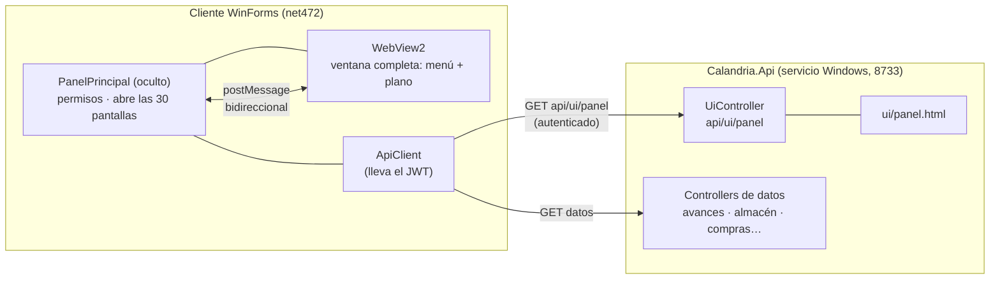

# Migración de la UI a web — pantalla principal en WebView2

**Fecha:** 29 de julio de 2026 · **Rama:** `feature/api-migration`

Este documento registra los cambios que habilitan servir pantallas web dentro del
cliente WinForms, y sirve de manual para migrar los módulos restantes.

> **Alcance:** cubre únicamente los cambios de estas sesiones. El árbol de trabajo
> tenía ya otros archivos modificados de trabajo previo (Compras, Nómina,
> Destajos, Almacén); no se tocaron.

## Estado

| | |
|---|---|
| Qué es hoy | **la pantalla principal completa** del cliente: ocupa toda la ventana y trae su propio menú |
| El shell WinForms | sigue existiendo, oculto detrás; es quien abre las 30 pantallas cuando la página lo pide |
| Confirmado corriendo en la app | sí — el panel arranca a pantalla completa y el menú abre los formularios |
| Sin confirmar en la app | el encuadre sin scroll, el arrastre y el zoom de rueda (§6) |
| Página | `Calandria.Api/ui/panel.html`, 888 550 bytes, autocontenida (anime.js y el plano incrustados) |
| Para publicar un cambio de UI | copiar ese archivo a `ui/` del servicio. Sin recompilar, sin reiniciar (§5.1) |

**Bitácora**

1. **1ª sesión.** Se eliminó el intento en WPF, se agregó el paquete WebView2 y el
   `UiController`, y la página sustituyó las cuatro tarjetas centrales del panel.
2. **2ª sesión.** La página pasó a ocupar la ventana completa con su propio menú
   —los 22 destinos conectados al puente—, se incrustó el plano de sembrado real
   y se le dio encuadre a pantalla, arrastre y zoom de rueda.
3. **3ª sesión.** Segundo módulo migrado: **Destajos**
   (`FormActivarTareasTreeList`). Nuevo `api/destajos` completo (lectura y
   escritura, ver `CONTINUAR_DESTAJOS_WEB.md`), nueva página
   `Calandria.Api/ui/destajos.html` (paso-a-paso, no plano) y nuevo partial
   `FormActivarTareasTreeList.Web.cs`. `UiController` dejó de estar
   hardcodeado a `panel.html`: ahora sirve cualquier página de una whitelist
   (`{pagina}`/`{pagina}/version`), así que este módulo no repitió el
   controlador, sólo sumó un nombre a la lista.
4. **4ª sesión.** Tercer módulo migrado: **Almacén** (`FormAlmacen`, las 5
   pantallas — Entradas, Salidas, Inventario, Historial y Consulta por casa;
   esta última ya estaba migrada desde antes). `AlmacenController` ampliado
   con 11 endpoints nuevos y `Calandria.Api/Models/AlmacenDtos.cs`, nueva
   página `Calandria.Api/ui/almacen.html` (rediseño con la skill
   `ui-ux-pro-max` + anime.js, mismos tokens que `panel.html`/`destajos.html`)
   y nuevo partial `FormAlmacen.Web.cs`. Se agregó también la conciliación de
   factura CFDI en Entradas (subir XML, cotejar contra la orden vía el
   endpoint ya existente `/api/ordenescompra/conciliar-factura`), que había
   quedado fuera de la primera versión de la página y se sumó después a
   pedido explícito, con su botón resaltado (`.btn-warn` + ícono) para que no
   pasara desapercibido. Ver detalle en §6.2.
5. **5ª sesión.** Cuarto módulo migrado: **Compras** — los tres formularios
   clásicos (`FormCompraMulti`, `FormCompraIndirecta`,
   `FormRepositorioPDFsOrdenesCompra`) en una sola página nueva
   (`Calandria.Api/ui/compras.html`, rail con 3 vistas: Orden múltiple /
   Compra indirecta / Consulta de órdenes) y un puente **standalone**, no
   partial: `DynamicSepticSystem/FormComprasWeb.cs` (más
   `OrdenCompraPdfService.cs` para el PDF, extraído tal cual de los
   formularios clásicos). No hizo falta tocar `ComprasController` /
   `OrdenesCompraController` / `RepositorioOrdenesController`: las fases 3a-3d
   de la migración a API ya habían movido toda la lógica de negocio al
   servidor, así que esta migración fue sólo vista + puente. Se encontró y
   corrigió un bug real al probar en vivo (ventana en blanco por
   `ShowDialog()`, ver §6.3). Ver detalle en §6.3.

---

## 1. Qué se decidió y por qué

Se evaluaron cuatro caminos para salir de WinForms: reescribir en WPF, Avalonia,
Tauri, o hospedar páginas web dentro del shell actual.

**Se eligió el híbrido** (WinForms como shell + WebView2 para el contenido) por
una razón concreta: **WinForms puede convivir con SQL directo, un frontend web no
puede.** 42 archivos del cliente siguen abriendo `SqlConnection`; una reescritura
web exigiría el API al 100 % *antes* de la primera pantalla. El híbrido permite
migrar pantalla por pantalla, como ya se venía haciendo con el API.

Ventaja añadida: cada pantalla que se migra así queda escrita en HTML/JS, o sea
**portable a un navegador o a Tauri sin reescribirla**. La misma base sirve para
el acceso desde celular en obra (evidencias fotográficas y avance).

Se descartó y **eliminó** el intento previo en WPF (ver §3.1): habría obligado a
mantener dos UIs nuevas a la vez, y su código arrancaba usando `SqlClient`
directo, repitiendo el cimiento que la migración al API busca quitar.

---

## 2. Arquitectura



**El punto clave:** el HTML lo descarga **el lado C#** con `ApiClient` (que ya
tiene el JWT) y se inyecta con `NavigateToString`. Consecuencias:

- **El token nunca entra a la página.** Si el HTML se comprometiera, no hay
  credencial que robar.
- **No hace falta CORS.** La página no emite peticiones HTTP; todo dato entra y
  sale por el puente `postMessage`.
- **La UI se actualiza sin reinstalar el cliente:** basta reemplazar
  `ui/panel.html` en el servidor.

---

## 3. Cambios por archivo

### 3.1 Eliminado — el intento en WPF

| Archivo | Nota |
|---|---|
| `DynamicSepticSystem/WPF/PanelPrincipal.xaml` | eliminado |
| `DynamicSepticSystem/WPF/PanelPrincipalWPF.xaml.cs` | eliminado |
| `obj/Debug/WPF/` | generados; declaraban `partial class PanelPrincipalWPF` |

No era código muerto: **había reemplazado el arranque** en las dos ramas de
`Program.cs`, con el original comentado al lado. Se restauró:

```csharp
// antes (rama #if DEBUG y rama del login)
// Application.Run(new PanelPrincipal());
var wpfApp = new System.Windows.Application();
wpfApp.Run(new PanelPrincipalWPF());

// ahora
Application.Run(new PanelPrincipal());
```

En `DynamicSepticSystem.csproj` se quitaron el `<Page Include="WPF\PanelPrincipal.xaml">`
y el `<Compile Include="WPF\PanelPrincipalWPF.xaml.cs">`.

`Casa.cs` y `TareaRutaCritica.cs` **se conservan**: `PanelPrincipal.cs`,
`TreeGridViewLite.cs` y `GenerarExplosionInsumosPDF.cs` los usan, no eran
huérfanos.

> Respaldo del código eliminado: se copió a un directorio temporal de sesión.
> **No es permanente.** La carpeta `WPF/` nunca estuvo en git, así que si ese
> código importa hay que recuperarlo de un respaldo propio.

### 3.2 Nuevo — el paquete WebView2

`packages/Microsoft.Web.WebView2.1.0.4078.44/` (última estable; `lib/net462`, que
es compatible con net472).

`DynamicSepticSystem/packages.config`:
```xml
<package id="Microsoft.Web.WebView2" version="1.0.4078.44" targetFramework="net472" />
```

`DynamicSepticSystem/DynamicSepticSystem.csproj` — dos referencias y, **crítico**,
la importación de los targets del paquete:

```xml
<Reference Include="Microsoft.Web.WebView2.Core">
  <HintPath>..\packages\Microsoft.Web.WebView2.1.0.4078.44\lib\net462\Microsoft.Web.WebView2.Core.dll</HintPath>
</Reference>
<Reference Include="Microsoft.Web.WebView2.WinForms">
  <HintPath>..\packages\Microsoft.Web.WebView2.1.0.4078.44\lib\net462\Microsoft.Web.WebView2.WinForms.dll</HintPath>
</Reference>
...
<Target Name="EnsureNuGetPackageBuildImports" BeforeTargets="PrepareForBuild">…</Target>
<Import Project="..\packages\Microsoft.Web.WebView2.1.0.4078.44\build\Microsoft.Web.WebView2.targets"
        Condition="Exists('…')" />
```

**Por qué el `<Import>` no es opcional:** es lo que copia `WebView2Loader.dll`
nativo a `runtimes\win-{x86,x64,arm64}\native\` junto al exe. Sin él **compila
igual** y el control revienta al instanciarse en ejecución. Es el primer paquete
del proyecto que necesita targets de MSBuild; los otros 67 sólo aportan DLLs.

### 3.3 Nuevo — el host híbrido

**`DynamicSepticSystem/PanelPrincipal.Web.cs`** (parcial de `PanelPrincipal`)

- Anota qué controles de primer nivel del formulario estaban visibles
  (`modernNavBar`, `panelSidebar`, `panelContenido`, `menuStripGeneral`…), los
  oculta y añade un `WebView2` con `Dock = Fill`: **la página ocupa la ventana
  completa**, menú incluido. Se guarda la lista para poder restaurar exactamente
  el estado previo y no revivir controles que ya estaban ocultos.
- Resuelve el HTML: **API → caché** en `%LOCALAPPDATA%\Calandria\ui\panel.html`.
  Consulta primero `api/ui/panel/version` y sólo descarga si el hash cambió; si
  el API no responde, arranca con la última copia.
- Traduce las acciones de la página a las pantallas que ya existen — las 22 del
  menú, no sólo las cuatro del plano (§4).
- **Cualquier fallo cae al panel clásico** (`RestaurarPanelClasico()`): sin
  runtime WebView2, sin HTML, o si el control no inicializa, vuelve a aparecer el
  panel WinForms de siempre. La UI nueva no puede dejar la app inservible. Lo
  mismo se puede pedir en caliente desde la página (botón *Panel clásico*), sin
  reiniciar.

`PanelPrincipal.cs` — una línea al final de `Form1_Load`:
```csharp
InicializarPanelWeb();
```

`App.config` — interruptor sin recompilar:
```xml
<add key="PanelWeb" value="true" />   <!-- false = panel WinForms clásico -->
```

### 3.4 Nuevo — el API sirve la UI

**`Calandria.Api/Controllers/UiController.cs`**

| Ruta | Devuelve |
|---|---|
| `GET api/ui/panel` | el HTML, con `ETag` (un cliente al día recibe 304) |
| `GET api/ui/panel/version` | `{hash, bytes, modificadoUtc}` — la llamada de cada arranque |

Ambas quedan protegidas por el filtro global `[Authorize]`. `RutaSegura()` impide
*path traversal*: rechaza caracteres inválidos y exige que la ruta resuelta quede
dentro de la raíz, comparando con separador final para que una carpeta `ui-otro`
no pase por ser prefijo de `ui`.

**`Calandria.Api/Configuracion.cs`** — propiedad `UiRuta`: carpeta `ui` junto al
exe por omisión, movible con la clave `UiRuta`, admite ruta absoluta.

**`Calandria.Api/Calandria.Api.csproj`**:
```xml
<Content Include="ui\**\*">
  <CopyToOutputDirectory>PreserveNewest</CopyToOutputDirectory>
</Content>
```

**`Calandria.Api/ui/panel.html`** — el panel (169 198 bytes, autocontenido:
anime.js v4.5.0 incrustado, sin recursos externos).

---

## 4. El contrato del puente

Es el mismo para toda pantalla que se migre. Sólo cambia el vocabulario de
`accion`.

### Página → C#

```js
window.chrome.webview.postMessage({
  accion: "estimacion",
  manzana: "5",          // sólo si hay casa seleccionada
  lote: "12"
});
```

En la página **no hay un `addEventListener` por botón**: un único manejador
delegado en `document` atiende todo lo que lleve `data-accion`, así que conectar
un botón nuevo es escribir el atributo y nada más.

Del lado C#, `WebPanel_Mensaje` lo traduce a las pantallas existentes:

| `accion` | Llama a |
|---|---|
| `seleccion` | `btnBuscarCasa_Click` (deja `casaActual` y etiquetas coherentes) |
| `compra-multiple` · `compra-indirecta` · `consultar-ordenes` | `AbrirFormCompraMulti()` · `AbrirFormCompraIndirecta()` · `AbrirRepositorioOrdenesCompra()` |
| `almacen` | `AbrirFormAlmacen()` |
| `destajos` · `editor-tareas` | `AbrirFormActivarTareasTreeList()` · `AbrirFormEditorTreeList()` |
| `avance-partidas` · `avance-conceptos` · `estimacion` | `AbrirFormAvanceObra()` · `AbrirFormAvanceConcepto()` · `AbrirFormEstimacionConcepto()` |
| `ruta-critica` · `editar-explosiones` | `AbrirFormRutaCritica()` · `AbrirFormEditarExplosiones()` |
| `hard-progress` · `mapear-coordenadas` | **\[ADMIN\]** `AbrirFormHardProgress()` · `AbrirFormMapearCoordenadas()` |
| `evidencias` | `AbrirFormEvidencias()` |
| `trabajadores` · `cuadrillas` · `perfiles` | `AbrirFormRegistrarTrabajador()` · `AbrirFormGestionCuadrillas()` · `AbrirFormPerfilTrabajador()` |
| `administrativos` · `diagnostico` | `AbrirFormAdministrativos()` · `btnDiagnosticoConexion_Click` |
| `log-errores` | **\[ADMIN\]** `AbrirFormLogErrores()` |
| `panel-clasico` · `cerrar-sesion` | `RestaurarPanelClasico()` · `btnCerrarSesion_Click` |

Una `accion` que no esté en el `switch` se registra en `LogErrores` con origen
`PanelWeb` en vez de perderse en silencio.

### C# → página

```csharp
webPanel.CoreWebView2.PostWebMessageAsJson(JsonConvert.SerializeObject(new {
    tipo = "datos",
    usuario = "...", rol = "...",
    esAdmin = Global.EsAdmin,
    casas = new[] { new { mz = "1", lote = 2, x = 2748f, y = 1852f } }
}));
```

**Los permisos se comprueban dos veces.** `esAdmin` sólo esconde las opciones
`[ADMIN]` en la página; el `switch` de `WebPanel_Mensaje` las vuelve a validar
contra `Global.EsAdmin` antes de abrir nada. El HTML llega del servidor, pero no
manda sobre permisos: ocultar un botón no es autorizar.

La página escucha y **si no hay host sigue funcionando** con los datos
incrustados. El puente es aditivo, lo que permite desarrollar la pantalla en un
navegador normal y sólo al final probarla dentro de la app.

---

## 5. Manual para migrar el siguiente módulo

El camino ya está pavimentado; migrar una pantalla son cinco pasos.

**1. Confirmar que el módulo ya tiene endpoints.** Éste es el filtro real. Si la
pantalla sigue con `SqlConnection` directo, primero va al API — no hay atajo.
Estado actual: Nómina, Avances, Evidencias, Fotos, **Destajos**
(`api/destajos`, ver `CONTINUAR_DESTAJOS_WEB.md`), **Almacén completo**
(`api/almacen`, las 5 pantallas, ver §6.2) y **Compras completo** (Orden
múltiple, Compra indirecta y Consulta de órdenes vía `api/compras` +
`api/ordenescompra` + `api/repositorio-ordenes`, ver §6.3) ya están migrados
a API + página web. No queda ningún módulo grande identificado sin
endpoints; el patrón queda pavimentado para lo que se agregue después.

**2. Escribir la página como documento HTML completo.** Obligatorio:

```html
<!doctype html>
<html lang="es">
<head><meta charset="utf-8">
```

El `charset` **no es opcional**: sin él WebView2 adivina la codificación y los
acentos se rompen (los `.cs` del cliente están en Windows-1252, ver
`reference_winforms_source_encoding`). Todo recurso va incrustado: sin CDN.

**3. Definir el vocabulario de `accion`** y ampliar el `switch` de
`WebPanel_Mensaje`. Reutilizar los métodos `AbrirFormXxx()` que ya existen;
no duplicar lógica.

**4. Alimentar la página desde el host, no desde la página.** El C# llama al API
con `ApiClient` y manda el resultado por `PostWebMessageAsJson`. Así el token
sigue fuera del HTML y no aparece CORS.

**5. Desplegar.** Copiar el `.html` a `Calandria.Api/ui/` y volver a desplegar el
API. El cliente lo recoge en el siguiente arranque — **sin reinstalar nada**.

### Cuándo el shell deja de ser WinForms

Cuando haya suficientes pantallas en web, el shell se sustituye (navegador o
Tauri) y **las páginas se reutilizan tal cual**; lo único a reescribir es el
puente, que pasaría de `postMessage` a llamadas HTTP directas contra el API. Ése
es el momento de resolver HTTPS y CORS, que hoy no existen (ver §7).

---

## 6. Qué se verificó y qué no

**Verificado**

| | |
|---|---|
| Cliente compila | Release, `-t:Rebuild`, 0 errores |
| API compila | Release, `-t:Rebuild`, 0 errores |
| `WebView2Loader.dll` nativo desplegado | `runtimes/win-{x86,x64,arm64}/native/` |
| `panel.html` en el output del API | 888 550 bytes |
| La página dentro de WebView2 | 118 lotes, anime.js cargado, acentos correctos, 0 errores JS |
| El plano de sembrado se ve | sí, y los 118 pines caen sobre su lote; comprobado en claro y en oscuro |
| Cabe sin scroll | `scrollHeight == innerHeight` a 1920×1080 y a 1366×768; el plano tampoco scrollea por dentro |
| Arrastre | mueve el viewBox exactamente los píxeles arrastrados, sin cambiar el zoom |
| Arrastrar no selecciona | el clic posterior a un arrastre se descarta; un movimiento < 4 px sigue siendo clic |
| Rueda | acerca dejando quieto el punto bajo el cursor (deriva ≤ 6 unidades de 4170) y conserva el aspecto |
| Rutas del API | `/api/health` → 200 · `/api/ui/panel` → 401 · ruta falsa → 404 |
| `bindingRedirect` del `exe.config` | 7, intactos |
| **Los 22 botones del menú** | cada uno manda exactamente su `accion` y ninguna otra |
| Botones de la ficha | `estimacion`, `destajos`, `evidencias`, `administrativos`, con manzana y lote |
| Ocultar `[ADMIN]` | con `esAdmin:false` se esconden las 3 opciones marcadas |
| Plegar/desplegar grupos del menú | sí |
| Botón de tema | ya **no** manda `destajos` al host (tenía un `data-accion` de más) |

Los cuatro últimos se comprobaron con una copia instrumentada de `panel.html`
—host de WebView2 fingido— cargada en Edge headless, pulsando cada botón y
comparando lo que salió por el puente contra su `data-accion`.

El contraste 401 / 404 importa: demuestra que el controller nuevo enruta, no que
falte. La prueba se hizo con una copia desechable en `localhost:8799`.

**No verificado**

- **La app ejecutándose.** Compila, pero no se lanzó `DynamicSepticSystem.exe`
  (no hay credenciales: `DebugUser`/`DebugPass` vacías). Sin confirmar: que el
  `Dock=Fill` no deje franjas del shell asomando, y que cada `accion` abra en
  efecto su formulario.
- **La respuesta 200 con el HTML.** Falta una llamada autenticada.
- **El deploy en el servidor.** El paquete está armado, no instalado. **Hasta que
  no se copie el `panel.html` nuevo a `ui/` del servicio, el cliente seguirá
  bajando el anterior** —que ya sale a pantalla completa, pero con el menú sin
  conectar—. Es el único paso que falta para que los botones funcionen.

Si el panel web no aparece, la causa queda en la tabla `LogErrores` con origen
`PanelWeb` (ADMINISTRATIVOS → Registro de Errores).

### 6.1 Destajos (3ª sesión) — misma honestidad

**Verificado**

| | |
|---|---|
| API compila | Release, `-t:Rebuild`, 0 errores (`DestajosController`, `UiController` generalizado) |
| Cliente compila | Release, `-t:Rebuild` con MSBuild de VS2022, 0 errores (`dotnet build` no sirve para este csproj clásico x86 en esta máquina: falla `GenerateResource`/MSB4216) |
| `destajos.html` en el output del API | 159 418 bytes, vía el mismo `<Content Include="ui\**\*">` genérico (no hizo falta tocar el csproj) |
| Rutas del API | ruta inexistente → **404** · `api/destajos/manzanas` sin token → **401** · `api/ui/destajos` sin token → **401** · `api/health` (pública) → **200** · `api/auth/login` GET → **405** · POST con credenciales inventadas → **401** propio del login, no del filtro. El contraste 404/401/200/405 demuestra que el pipeline distingue "ruta inexistente", "ruta protegida sin token", "ruta pública" y "pública con error propio" — no que todo esté bajo un mismo candado ciego. Probado con una copia desechable en `localhost:8799`. |
| La página en Edge headless con host de WebView2 fingido | 20/20 aserciones automatizadas (script en el scratchpad de la sesión, no versionado): pide manzanas al detectar el host; puebla selects; `cargar-lotes`/`cargar-casa` llevan el valor elegido; el árbol simulado pinta 2 pasos con la variante de color correcta (`s-brass` = Disponible); seleccionar un paso llena la ficha; el insumo con `surtido < cantidad` se marca pendiente; el botón Activar manda `{accion:"activar", nodoId, manzana, lote, ruta, prototipo}`; `esAdmin:false` esconde Desactivar y `esAdmin:true` lo muestra; los botones del riel (`insumos`/`historial`/`arbol-completo`/`volver`) mandan su acción exacta; el botón de tema fija `data-theme`. 0 errores de JS en toda la corrida. |
| `Surtido` nuevo en `ItemTareaActivacion` | no rompe nada existente (propiedad aditiva, con valor por omisión 0) |
| Codificación | `FormActivarTareasTreeList.Web.cs` quedó en UTF‑8 sin BOM (no ASCII-only como decía el plan original); confirmado que el `.exe` compilado embebe las cadenas acentuadas como UTF‑16 genuino, sin mojibake — ver detalle en `CONTINUAR_DESTAJOS_WEB.md` Tarea 4 |

**No verificado**

- **La app ejecutándose de verdad.** Igual que con el panel: compila, pero no se
  lanzó `DynamicSepticSystem.exe` contra la BD real (sin credenciales de
  prueba). Sin confirmar en vivo: que `InicializarPanelWeb()` oculte
  exactamente los controles correctos de `FormActivarTareasTreeList`, que el
  puente reciba mensajes reales del WebView2 (la prueba en Edge headless usa
  un host **simulado**, no el control WebView2 real), y que
  `FormAsignarCuadrilla`/`FormAsignarNomina`/`PromptJustificacion` se abran
  centrados sobre la ventana correcta.
- **Las escrituras contra la BD real** (`activar`/`finalizar`/`desactivar`/
  `reabrir`/`pdf`). Deliberadamente no se probaron: la cadena de conexión del
  `.exe.config` apunta a la base de producción (`100.75.234.9`, `CALANDRIA`) y
  ensayar transiciones de estado ahí sin supervisión habría dejado datos de
  prueba mezclados con reales. Requiere una sesión explícita contra una BD de
  prueba o con el usuario presente.
- **La whitelist de `UiController` distinguiendo página válida de inválida.**
  El filtro `[Authorize]` global corta con 401 antes de que el código de la
  whitelist se ejecute, así que sin un token real no se pudo confirmar que
  `api/ui/almacen` (no listado) dé 404 en vez de 200. La lógica es trivial
  (`Array.IndexOf`) pero queda sin probar en caliente.
- **El deploy en el servidor.** Igual que `panel.html` (§6, no repetido aquí):
  el paquete está armado, no instalado. `destajos.html` tampoco existe todavía
  en el `ui/` del servicio real.

---

### 6.2 Almacén (4ª sesión) — misma honestidad

**Verificado**

| | |
|---|---|
| API compila | Release, `-t:Rebuild`, 0 errores (`AlmacenController` ampliado con 11 endpoints nuevos, `AlmacenDtos.cs` nuevo; los 3 endpoints previos de Consulta por casa no se tocaron) |
| Cliente compila | Release, `-t:Rebuild` con MSBuild de VS2022, 0 errores (mismo motivo que Destajos: `dotnet build` falla `GenerateResource`/MSB4216 en este csproj clásico x86). Único warning nuevo: `CS0649` en `MsgConciliarFactura`, mismo patrón preexistente (campos que Newtonsoft llena por reflexión) |
| `almacen.html` en el output del API | 178 209 bytes (tras resaltar el botón de conciliar factura), vía el mismo `<Content Include="ui\**\*">` genérico — no hizo falta tocar el csproj del API |
| Rutas del API | ruta inexistente → **404** · los `api/almacen/*` nuevos (historial, inventario, entrada, salida, etc.) y `api/ui/almacen`(`/version`) sin token → **401** · `api/health` → **200**. Probado con copia desechable en `localhost:8799`, mismo contraste que Destajos |
| La página en Edge headless, standalone y con host de WebView2 fingido | **23/23 aserciones** automatizadas (script en el scratchpad, no versionado) sobre las 5 secciones (Entradas, Salidas, Inventario, Historial, Consulta por casa) y el contrato completo de mensajes, incluyendo la conciliación CFDI |
| Regresión del panel clásico | confirmado por `git diff`: ningún `FormAlmacen_Entradas.cs`/`_Salidas.cs`/`_Inventario.cs`/`_Historial.cs`/`_ConsultaCasa.cs`/`_ExtensionPDFSalidas.cs`/`SalidaAlmacenService.cs` cambió. El único cambio en un archivo clásico preexistente es `+5` líneas en `FormAlmacen_Core.cs` (llamada a `InicializarPanelWeb()` en el constructor) |
| Paquete de deploy armado | `Calandria.Api/deploy/CalandriaApi_deploy_20260730_004815.zip`, incluye `ui/almacen.html` ya con el botón de conciliar factura resaltado |

**Dos bugs reales atrapados y corregidos durante la propia verificación** (no
eran parte del plan, los encontró el arnés automatizado):

1. **TDZ en `almacen.html` modo standalone.** El bootstrap sin host llamaba
   `cargarManzanasDemo()` antes de que las `const selManzanaSalida` /
   `selLoteSalida` / `selManzanaConsulta` / `selLoteConsulta` estuvieran
   declaradas más abajo en el archivo. Corregido subiendo esas 4
   declaraciones antes del bootstrap.
2. **Corrupción de codificación en `FormAlmacen_Core.cs`.** Agregar la línea
   `InicializarPanelWeb();` hizo un *round-trip* UTF-8/Windows-1252 que
   reemplazó 3 acentos preexistentes en comentarios por caracteres de
   reemplazo (U+FFFD) — pérdida de datos real si quedaba sin corregir.
   Reconstruido byte a byte desde `git show HEAD` + las líneas nuevas. Ver
   `reference_winforms_source_encoding`: el riesgo existe incluso al **sólo
   agregar** líneas ASCII a un archivo Windows-1252, si la herramienta de
   edición reescribe el archivo completo en UTF-8.

**Detalle de negocio no obvio, documentado para no repetir el error:**
`FormAlmacen_Inventario.cs` (y por tanto `GET api/almacen/inventario`) es en
realidad un **listado crudo de `EntradasAlmacen`**, no un cálculo de stock
corriente (`SUM` entradas − `SUM` salidas) como el nombre sugiere.

**No verificado** (mismo patrón que Destajos, mismos motivos)

- **La app ejecutándose de verdad contra la BD real.** Compila, pero no se
  lanzó `DynamicSepticSystem.exe` con credenciales reales en esta máquina.
- **Las escrituras reales** (`entrada`, `salida`, `conciliar-factura`,
  `generar-vale`) contra la base de producción (`100.75.234.9`).
  Deliberadamente no se probaron, mismo resguardo que Destajos: la cadena de
  conexión del `.exe.config` apunta a producción y una prueba de escritura
  ahí mezclaría datos de prueba con reales sin supervisión.
- **El deploy en el servidor.** El paquete está armado
  (`CalandriaApi_deploy_20260730_004815.zip`), no instalado. Hasta que no se
  copie a `C:\CalandriaApi\` y se corra `reiniciar-servicio.bat` ahí, el
  cliente seguirá sin ver `almacen.html` ni los endpoints nuevos.

---

### 6.3 Compras (5ª sesión) — misma honestidad

**Decisión de diseño distinta a Almacén/Destajos:** Compras tenía **tres**
formularios clásicos (dos de captura — `FormCompraMulti`,
`FormCompraIndirecta` — y uno de sólo lectura —
`FormRepositorioPDFsOrdenesCompra`). En vez de tres partials retrofiteando
cada formulario clásico, se creó **`FormComprasWeb.cs` como ventana nueva e
independiente** (no `partial class` de ninguno de los tres) que hospeda las
3 vistas de `compras.html` con un rail de navegación interno. Evita duplicar
~500 líneas de despacho de mensajes en tres archivos. `PanelPrincipal` decide
cuál abrir según `ComprasWeb` en `App.config`:

```csharp
if (ComprasWebActivo) new FormComprasWeb("multi").Show();      // Orden múltiple
else { var frm = new FormCompraMulti(); frm.ShowDialog(); }     // clásico, intacto

if (ComprasWebActivo) new FormComprasWeb("indirecta").Show();
if (ComprasWebActivo) new FormComprasWeb("consulta").Show();
```

`ComprasWeb=false` sigue abriendo los tres formularios clásicos sin
recompilar — ninguno de los tres se tocó.

**Verificado**

| | |
|---|---|
| Cliente compila | Debug y Release, `-t:Rebuild` con MSBuild de VS2022, 0 errores. Único patrón de warning nuevo: `CS0649` en las clases `MsgXxx` de `FormComprasWeb.cs` (Newtonsoft las llena por reflexión), mismo patrón ya presente en `FormAlmacen.Web.cs`/`FormActivarTareasTreeList.Web.cs` |
| API compila | Release, `-t:Rebuild`, 0 errores. **No se tocó** `ComprasController`/`OrdenesCompraController`/`RepositorioOrdenesController`/`ComprasDtos.cs` — todo lo que la página necesita ya existía de las fases 3a-3d de [[project_api_migration]]; el único cambio fue sumar `"compras"` a la whitelist de `UiController` |
| `compras.html` en el output del API | 205 591 bytes, vía el mismo `<Content Include="ui\**\*">` genérico, incluye el mismo bundle de anime.js v4 (idéntico byte a byte al de `destajos.html`/`almacen.html`, confirmado con `cmp`) |
| Cobertura funcional | contrastada de forma independiente contra los tres formularios clásicos (Orden Múltiple, Compra Indirecta, Consulta de Órdenes) por separado: coincide 1:1 en campos, validaciones, acciones y edge cases (insumos sin clave resaltados en naranja, mover al carrito en vez de duplicar, tipo de título administrativa/indirecta, eliminar en cascada, etc.) |
| Regresión del panel clásico | `FormCompraMulti.cs`/`FormCompraIndirecta.cs`/`FormRepositorioPDFsOrdenesCompra.cs` sin tocar; `PanelPrincipal.cs` sólo gana la propiedad `ComprasWebActivo` y la rama `if/else` en los 3 puntos de apertura |
| Paquete de deploy armado | `Calandria.Api/deploy/CalandriaApi_deploy_20260730_040916.zip` (2.28 MB, Release), incluye `ui/compras.html` |

**Bug real atrapado en vivo y corregido** (no lo detectó la compilación, lo
encontró el usuario al probar): `FormComprasWeb` se abría con `.ShowDialog()`
en los 3 puntos de `PanelPrincipal` → ventana en blanco +
`COMException 0x80004004 (E_ABORT)` en `CreateCoreWebView2ControllerAsync`,
pese a usar su propia carpeta de datos de usuario (`WebView2Compras`). Es el
mismo bug estructural ya documentado en
[[reference_webview2_multi_instance]] para Destajos: un WebView2 **modal**
sobre el de `PanelPrincipal` (que ya tiene el suyo activo vía `PanelWeb=true`)
rompe la inicialización sin importar el entorno propio. **Corrección:** las 3
llamadas pasaron de `.ShowDialog()` a `.Show()`, igual que `FormAlmacen` y
`FormActivarTareasTreeList`.

**Segundo gap encontrado y corregido, mismo pase de verificación:** el menú
"Consultar Órdenes" (`miConsultarOrdenes` → `AbrirRepositorioOrdenesCompra()`
en `PanelPrincipal.cs`) abría siempre `FormRepositorioPDFsOrdenesCompra`
clásico sin mirar `ComprasWeb` — la vista "Consulta de órdenes" de
`compras.html` quedaba inalcanzable desde el menú aunque existiera y
funcionara. Ya respeta el flag igual que Orden Múltiple/Indirecta.
(`OrdenCompraMultiple_Click`, otro método con un menú contextual de 3
opciones en el mismo archivo, resultó ser código muerto — no está enlazado a
ningún control — así que no se tocó.)

**No verificado**

- **Que el fix de `.ShowDialog()` → `.Show()` resuelva el blanco de verdad.**
  Es el mismo cambio que sí funcionó para Destajos (confirmado por el usuario
  en su momento), pero para Compras quedó pendiente reconfirmar en vivo — el
  rebuild posterior al fix no se pudo correr porque el `.exe` estaba
  bloqueado por el depurador de Visual Studio en plena prueba.
- **Las escrituras reales** (generar orden múltiple, generar orden
  indirecta, eliminar del repositorio) contra la base de producción
  (`100.75.234.9`). Mismo resguardo que Destajos/Almacén: no se ensayaron
  sin supervisión del usuario.
- **El deploy en el servidor.** El paquete está armado
  (`CalandriaApi_deploy_20260730_040916.zip`), no instalado. Hasta que no se
  copie a `C:\CalandriaApi\` y se reinicie el servicio ahí, el cliente
  seguirá sin ver `compras.html` en el API real.

---

## 7. Pendientes

### Del panel actual

1. **Los KPIs y el avance de la página son simulados.** El host sólo manda
   coordenadas. Conectar lo real es llamar `/api/avances/estimacion-jerarquica`
   desde el host y mandarlo por el mismo puente.
2. **`coordenadas_mapa.json` sigue siendo local**, en el `StartupPath` de cada
   cliente. Cada máquina tiene su copia y quien no corrió *Mapear Coordenadas* no
   ve nada. Debería ser tabla + endpoint: cuatro columnas y ninguna lógica.
3. **El mapeo está incompleto:** 118 casas, y a M1 le faltan los lotes 1 y 12.
   Conviene una consulta que liste las casas de `InventarioCasas` sin coordenada,
   porque hoy simplemente no aparecen y nadie se entera.
4. **Son puntos, no polígonos.** Para pintar la forma real de cada lote habría que
   extender `CoordenadasCasa` con `List<PointF> Poligono` (retrocompatible: si es
   null, se usa el pin). Si el plano salió de CAD, exportarlo a SVG daría los
   polígonos de regalo.
5. ~~**El PNG pesa 7 MB.**~~ **Resuelto.** `MapaSembrado.png` (7200×4800, 7 MB)
   se redujo a 3600 px de ancho y se recodificó a WebP q80: **530 KB**, incrustado
   como `data:` en la página. Se estira a 7200×4800 unidades de usuario, así que
   `coordenadas_mapa.json` sigue cayendo en su sitio sin recalcular nada.

   ```
   ffmpeg -i Resources/MapaSembrado.png -vf scale=3600:-1:flags=lanczos \
          -c:v libwebp -quality 80 -compression_level 6 mapa.webp
   ```

   Dos cosas a tener presentes: la página pasó de 176 KB a **883 KB**, y
   `NavigateToString` **no admite más de 2 MB** — ése es el techo real para
   seguir incrustando recursos. Y en tema oscuro la lámina se invierte por CSS
   (`filter:invert(1) hue-rotate(180deg)` sobre `#plano`) para que no quede un
   tablón blanco; el `hue-rotate` devuelve los colores de los lotes.

### Del despliegue

6. **El actualizador debe llevar los archivos nuevos.** El zip de
   `Actualizador.cs` tiene que incluir `Microsoft.Web.WebView2.Core.dll`,
   `.WinForms.dll` y la carpeta `runtimes\`. Si no, **funciona en desarrollo y
   falla en la obra** — el fallo aparece después del despliegue.
7. **El runtime WebView2 en cada equipo.** Es Evergreen y en Win10 suele venir
   con Edge, pero "suele" no es "siempre". El host ya lo detecta y cae al panel
   clásico registrando en `LogErrores`; conviene revisar ese log tras el primer
   despliegue.
8. Quedaron `packages.config.bak` y `DynamicSepticSystem.csproj.bak` en el
   proyecto. Borrar cuando haya conformidad.

### Infraestructura (bloqueante para navegador y celular)

9. **No hay HTTPS.** `BaseUrl = http://+:8733`. Un PWA necesita TLS para service
   worker e instalación, e iOS/Android bloquean tráfico en claro.
10. **No hay CORS.** Hoy no estorba porque el host inyecta el HTML; el día que
    una página hable directo con el API, sí.
11. **Sólo LAN.** Desde obra con datos móviles el API no existe. Cloudflare
    Tunnel, Tailscale o reverse proxy con Let's Encrypt.
12. **El JWT vence en horas** (`JwtHorasVigencia`). Un supervisor se queda fuera a
    media jornada; hace falta vigencia larga o refresh token.

---

## 8. Seguridad — atender antes de seguir

Hallado al editar los `App.config`. **No se tocó nada**: rotar secretos en
producción es decisión del dueño.

`Calandria.Api/App.config` y `DynamicSepticSystem/App.config` **están en git** y
contienen, en texto plano:

| Secreto | Riesgo |
|---|---|
| `JwtSecreto` (64 chars) | **el más grave** |
| Contraseña de `sa` de producción | acceso total a la BD `CALANDRIA` |
| `GitHubToken` (`github_pat_…`) | distribuido en el `.exe.config` de cada equipo |
| `GeminiApiKey` | consumo facturable a cuenta ajena |

El `JwtSecreto` es el peor porque **firma los tokens**: quien lo tenga puede
emitirse uno válido con el rol que quiera y hablarle al API como administrador,
sin necesitar ninguna contraseña. Eso convierte el repositorio en la llave del
sistema completo.

Orden sugerido:

1. **Rotar primero** el `JwtSecreto` y la contraseña de `sa`; revocar el PAT y la
   key de Gemini.
2. Sacar los valores de los `App.config` versionados (variables de entorno o un
   config fuera de git).
3. Recién entonces limpiar el historial.

Rotar va primero porque el historial de git ya está distribuido en cada clon:
borrarlo del historial no invalida lo que alguien ya clonó.

Relacionado: el `GitHubToken` existe porque el cliente descarga actualizaciones
de GitHub. Que el API haga de intermediario eliminaría la necesidad de que el
cliente tenga credencial alguna — el mismo patrón que ya se sigue con SQL.
